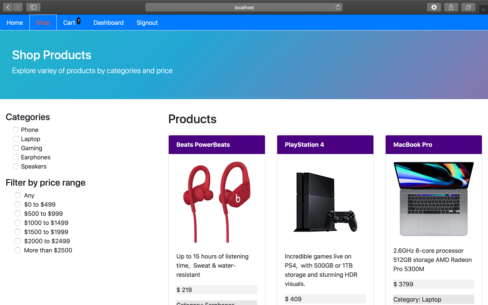
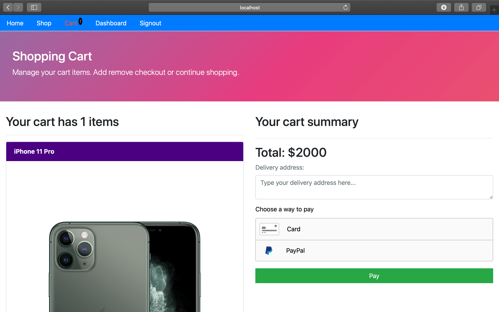
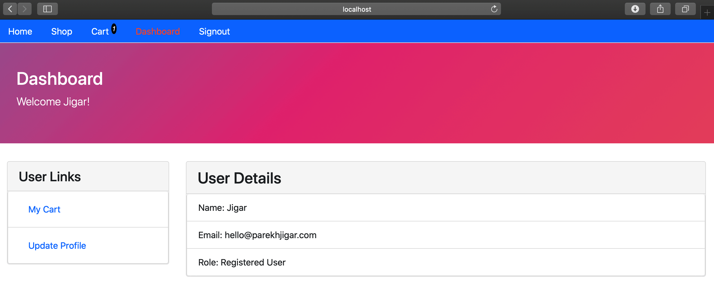

# Unbox- A MERN Stack webapp

The following project is developed on MacOS Catalina.
Following packages are required to create the environment for the project.

## Initializing Package.json

	`$ npm init -y`

## Installing NPM Packages to setup express server

### 1. express

Express framework is used to organize the web application into an MVC architecture on the server side.

	`$ npm i express`

### 2. dotenv
Dotenv module will load environment variables from a .env file that is create and adds them to the process.env object that is made available to the application.

	`$ npm i dotenv`

### 3. nodemon
Nodemon automatically restarts the node application when file changes in the directory are detected.

	`$ npm i nodemon`

## Installing MongoDB Community Edition

[MongoDB documentation](https://docs.mongodb.com/manual/administration/install-community/) for detailed installation steps.

### Install Homebrew on MacOS

	`$ ruby -e "$(curl -fsSL https://raw.githubusercontent.com/Homebrew/install/master/install)"`

### Tap the MongoDB Homebrew Tap

	`$ brew tap mongodb/brew`

### Installing mongodb-community@4.2

	`$ brew install mongodb-community@4.2`

### Installing Mongoose

	`$ npm i mongoose`

### Installing uuid

	`$ npm i uuid`

### Installing body-parser

	`$ npm i body-parser`

### Installing morgan

	`$ npm i morgan`

### Installing cookie-parser

	`$ npm i cookie-parser`

### Installing express-validator 5.3.1

	`$ npm i express-validator`

### Installing express-jwt

	`$ npm i express-jwt`

### Installing jsonwebtoken

	`$ npm i jsonwebtoken'

### Installing formidable

	`$ npm i formidable'

### Installing lodash

	`$ npm i lodash'

### Installing cors

	`$ npm i cors'

### Installing braintree

	`$ npm braintree'
